## Welcome to Scrooge

This is a simple invoice and tracking application suited for small companies. It helps you in managing your daily task in your daily business: track activities, expenses and invoices.

What can you do with scrooge?

- Tracking your daily job activities
- Managing the job orders and checking their status
- Creating an invoice 
- Generate a pdf-invoice
- Tacking expenses
- Tracking invoice payment status
- View the current status (economics, in/out)
- Managing users
- Managing customers
- Real-time activity tracker
- English support
- Added activity expenses with attachment (stored on Amazon S3)
- Weekly activities. Easily insert you activities of the week on one screen.

It's built on **Rails 4.0**.

You can find a live demo: [http://plasticscrooge-demo.herokuapp.com/](http://plasticscrooge-demo.herokuapp.com/)
Use this credentials:

user: demo@codiceplastico.com

pwd: demopwd

### Installation
1. Clone the repository
2. Install the gems with `bundle install`
3. Setup the database `rake db:migrate` and `rake db:seed`
4. Start the server `rails s`

### Configuration
There are some settings that you have to set in the setting page.
These are:

- *iva*: vat coeff
- *iban* bank account number
- *dropbox_enabled*: enable/disable dropbox support
- *dropbox_app_key*: dropbox credentials
- *dropbox_app_secret*: dropbox credentials
- *dropbox_token*: dropbox credentials
- *dropbox_secret*: dropbox credentials
- *dropbox_folder*: dropbox folder to use
- *dropbox_app_mode*: dropbox mode
- *footer*: invoice footer (in pure HTML)
- *s3_bucket*: s3 storage bucket name
- *s3_access_key_id*: s3 credential
- *s3_secret_access_key*: s3 credential

To obtain the keys for DROPBOX you can read this http://ema.codiceplastico.com//rails/2013/03/22/usare-dropbox-da-unapplicazione-rails.html

If you want access to S3 you need to configure the bucket on the S3 console and specify the keys on the settings page(s3_access_key_id, s3_secret_access_key).

### Version history 
- 11-04-2013 Drop 1 (first release with basic functionalities)
- 10-09-2013 Drop 2 (migrated to Rails 4.0 and Ruby 2.0)
- 02-10-2013 Drop 3 (Activity tracker and bug fixes)
- 11-10-2013 Drop 4 (new design based on Boostrap 3.0)
- 15-11-2013 Drop 5 (added settings and year-month filter in invoice view)
- 28-12-2013 Drop 6 (Multilanguage support through i18n (Italian, English))
- 18-04-2014 Drop 7 (Expenses module. Track activity expenses)
- 19-04-2014 Drop 8 (Added mini charts in dashboard (using [http://charts.brace.io/](http://charts.brace.io/)))
- 17-06-2014 Drop 9 (Added expenses attachments)
- 13-12-2014 Drop 10 (Added weekly activities)

### Screenshots
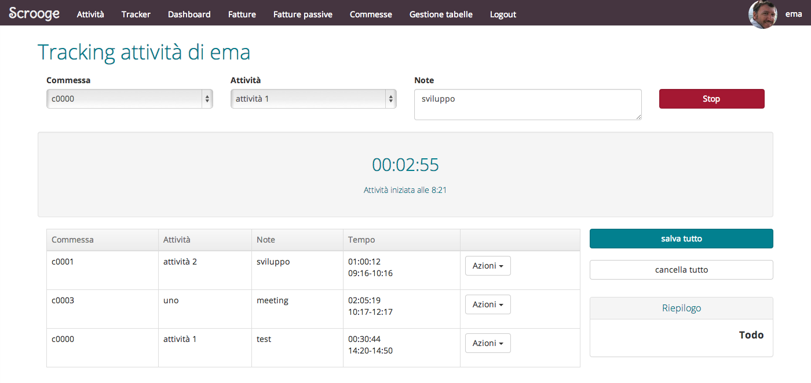
***
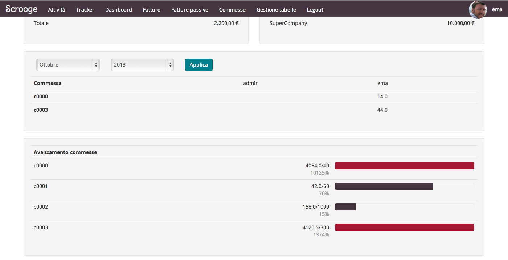
***
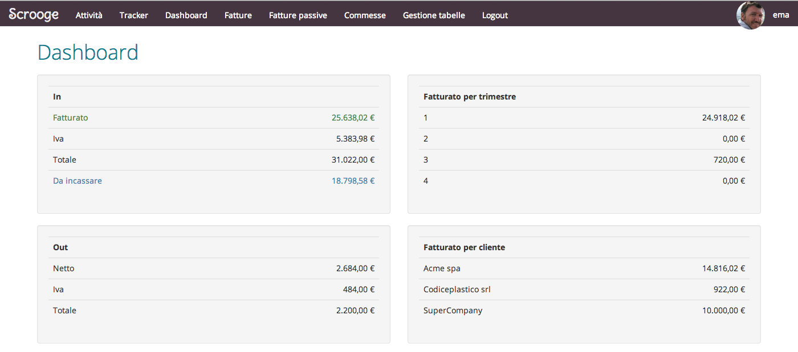
***
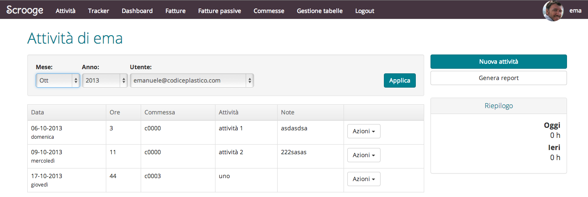
***
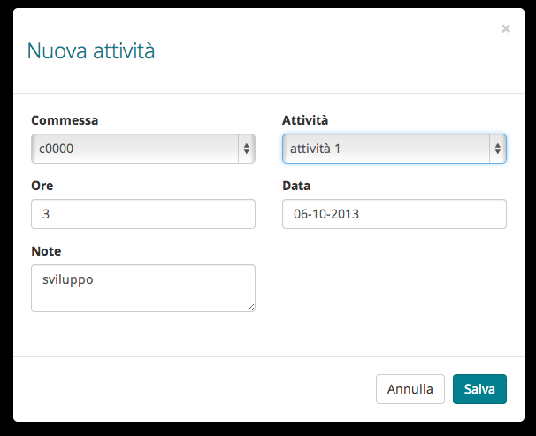
***
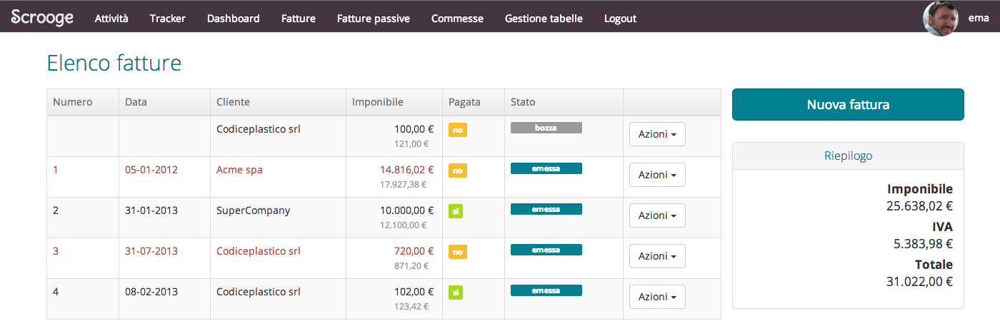
***
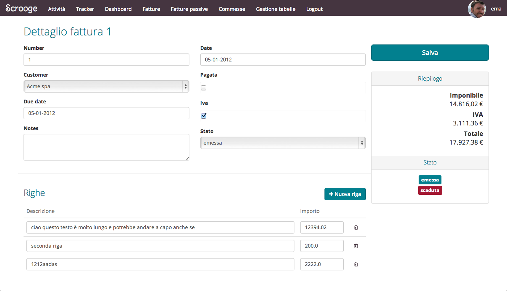
***
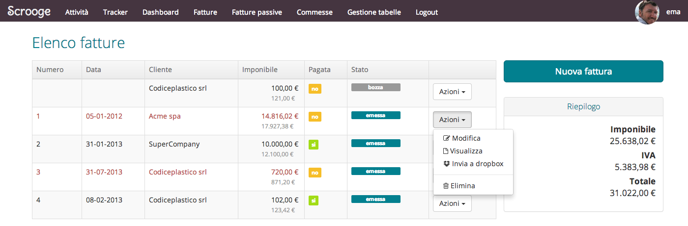
***
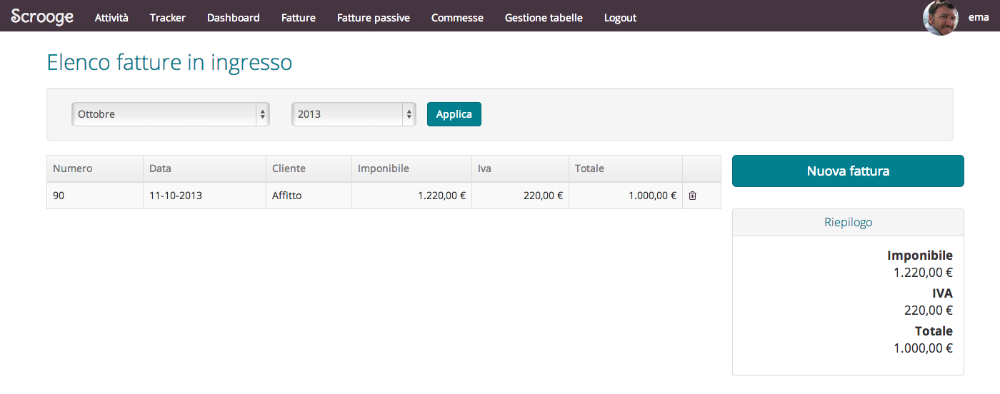
***
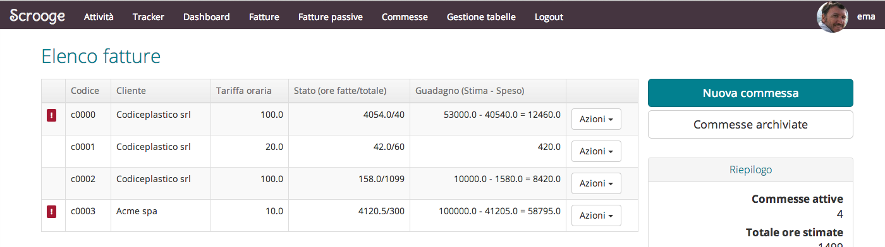
***
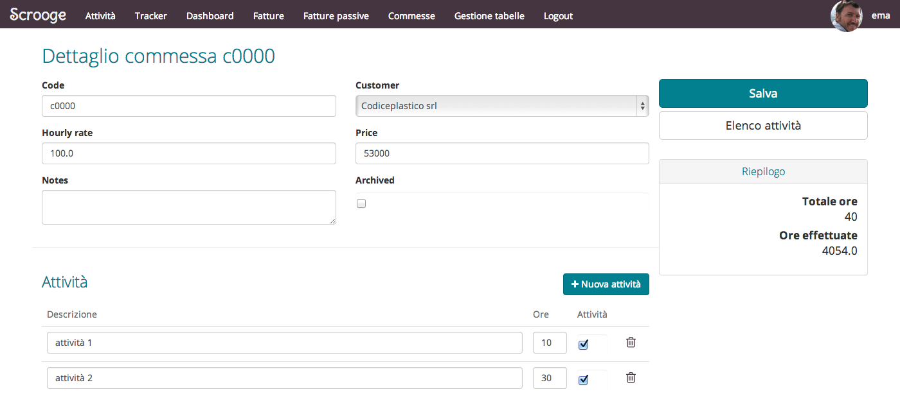
***
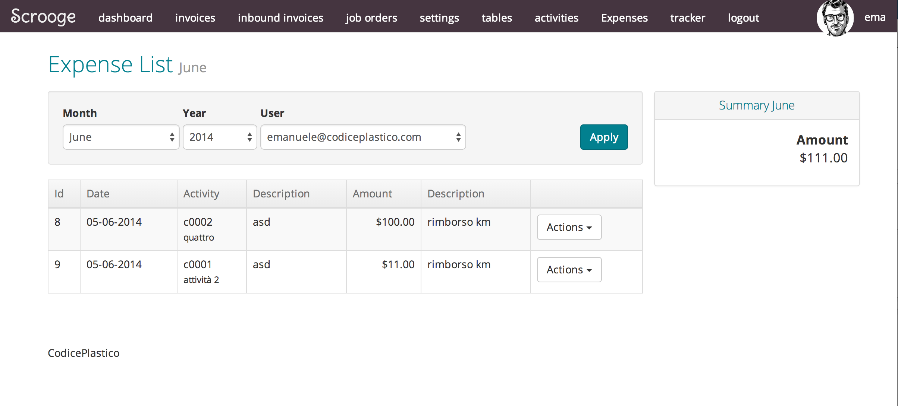
***
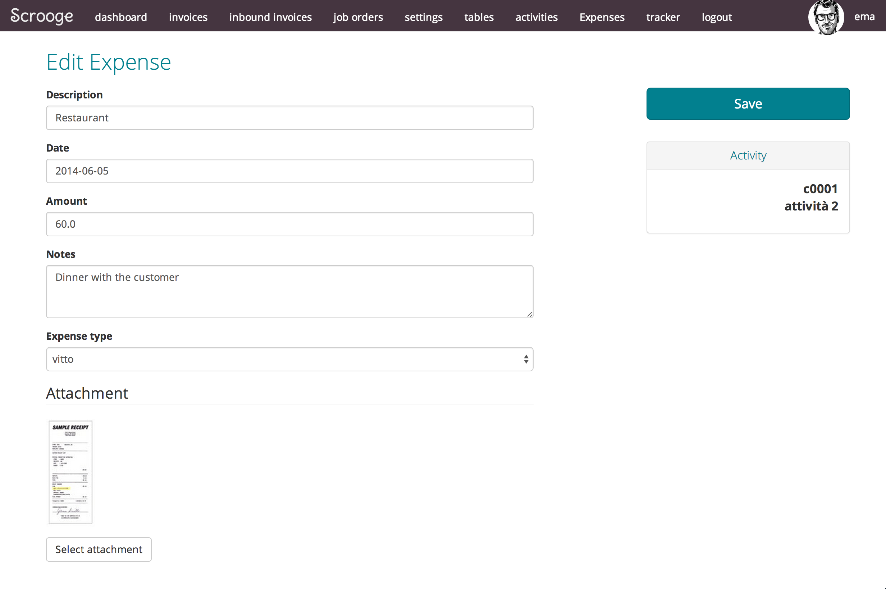
***
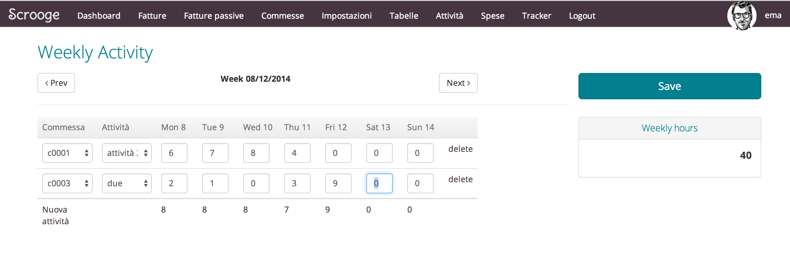
***
